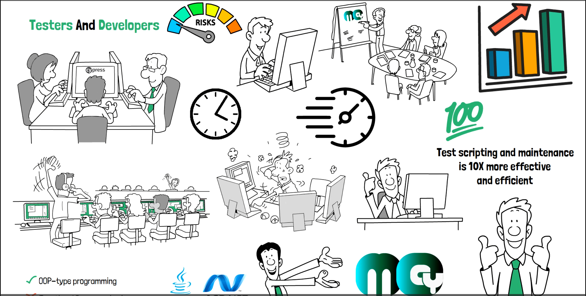

<p align="center">
  <a href="https://www.mocypress.com">
    <picture>
      <source media="(prefers-color-scheme: dark)"  srcset="./src/resources/bin/mocypress-logos.png">
      <source media="(prefers-color-scheme: light)" srcset="./src/resources/bin/mocypress-logos.png">
      
    </picture>    
  </a>
</p>
<p align="center">
  <a href="https://www.mocypress.com">Documentation</a> |
  <a href="https://www.mocypress.com">Changelog</a> |
  <a href="https://www.mocypress.com">Roadmap</a>
</p>

<h3 align="center">
  The Better Version od Cypress for Test Engineers..
</h3>

<p align="center">
  MOCypress is the extend simplified version of Cypress.io, especially designed for Test Engineers
</p>
<p align="center">
  Join with us, our test <a href="https://www.linkedin.com/company/mocypress">community</a>.
</p>

<p align="center">
  <a href="https://www.npmjs.com/package/cypress">
    
  </a>
  <a href="https://gitter.im/cypress-io/cypress">
    
  </a>
    <a href="https://stackshare.io/cypress">
    
  </a><br />
</p>

## What is MOCypress?

<p align="center">
  <a href="https://vimeo.com/787284836">
    
  </a>
</p>

## Installing

[](https://badge.fury.io/js/cypress)

Install Cypress for Mac, Linux, or Windows, then [get started](https://on.cypress.io/install).

```bash
npm install -g mocypress-cli
```
and, makesure "@mocypress/mocypress": "^x.x.x", package include in package.json
```bash
npm mocypress open
```

## Why MOCypress is better?
MOCypress is an Object-Oriented flavor of the Cypress for Test Engineers and Its facilitating cypress scripting workaround for non-technical testers to perform test automation  with more productive and efficient manner. This is all in one solution for every organization to drive you project with non-technical test team align with global tech evolution.


## Contributing

Please see our [Contributing Guideline](./CONTRIBUTING.md) which explains repo organization, linting, testing, and other steps.

## How we work

At Cypress we value our community and strive to be as open and transparent with them as possible.  Check out [our guide](https://www.mocypress.com/) on how we prioritize community issues.

## License

[](https://github.com/cypress-io/cypress/blob/develop/LICENSE)

This project is licensed under the terms of the [MIT license](/LICENSE).

## Badges

Let the world know your project is using Cypress.io amd MOCypress to test with this cool badge.
We are using Cypress.io

[](https://www.cypress.io/)

